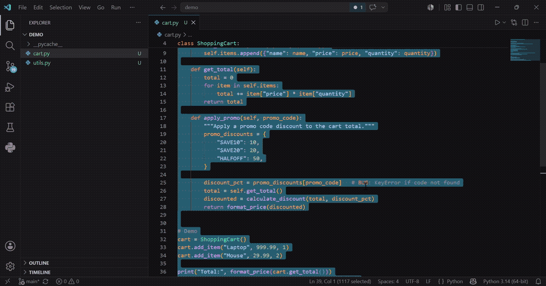

# Neo Bug Forge — AI Bug Fixer for VS Code & Cursor

**Tired of copy-pasting errors into ChatGPT?** Fix bugs without leaving VS Code — click any red squiggle, get fixed code + explanation in seconds.

## Key Features

- ✨ **Lightbulb Quick Fix** — click any red squiggle → ⚡ Fix with AI
- 🤖 **Auto-demo on install** — see it fix a real bug the moment you install
- 🧠 **Deep workspace context** — understands your entire project
- 🔄 **Smart retry** — remembers previous attempts, tries a different approach
- 📝 **One-click Save Test File** + test generation
- ✅ **Clean diff preview** with one-click apply + Git stage
- ⚡ **Works in Cursor and VS Code**

**Try free — no credit card, no signup. Just install and fix.**

---

## What's new in v1.5

- **Auto-demo on install** — first-time users see AI fix a real bug automatically, no setup needed
- **Lightbulb on unsaved files** — works on new files before you even save them
- **Improved lightbulb label** — now shows "⚡ Fix with AI — Neo Bug Forge" for clarity

---

## Installation

1. Open **VS Code** → Extensions (`Ctrl+Shift+X`)
2. Search **"Neo Bug Forge"**
3. Click **Install**
4. Get a free API key at **[neobugforge.io](https://neobugforge.io)**
5. Run `Ctrl+Shift+P` → **Neo Bug Forge: Set API Key** → paste your key

---

## Usage

### Fastest way — lightbulb (v1.4)
1. Hover over any red squiggle in your code
2. Click the 💡 lightbulb (or press `Ctrl+.`)
3. Select **⚡ Fix with Neo Bug Forge**
4. The panel opens and auto-submits — fix appears in seconds

### Keyboard shortcut
1. Select the broken code in your editor
2. Press `Ctrl+Shift+F` (Windows/Linux) or `Cmd+Shift+F` (Mac)
3. Paste the error message

### Right-click menu
Select code → right-click → **Neo Bug Forge: Fix Selected Code**

### Panel (manual)
Command Palette → **Neo Bug Forge: Open Panel** → paste code and error → **⚡ Fix My Bug**

---

## What you get back

| | |
|---|---|
| ✅ Fixed code | Complete, corrected version — ready to apply |
| 🔍 Diff preview | Side-by-side diff in VS Code's native editor before you commit |
| 🧠 Explanation | Plain-English: what was wrong and what changed |
| 📊 Confidence | How certain the AI is (0–100%) |
| 🏷 Root cause | null_reference · type_mismatch · off_by_one · logic_error · and more |
| 🧪 Test case | Minimal unit test that would have caught this bug — save it with one click |

---

## Lightbulb Quick Fix (v1.4)

Neo Bug Forge integrates with VS Code's diagnostic system. Whenever your language server, TypeScript, ESLint, or any linter flags an error, the ⚡ lightbulb appears automatically. No manual selection needed.

**Configure in Settings:**
- `neo-bug-forge.diagnostics.enabled` — turn the lightbulb on/off (default: on)
- `neo-bug-forge.diagnostics.severityThreshold` — `error` (default) · `warning` · `all`

---

## Deeper Context (v1.3)

When you trigger a fix from the editor, Neo Bug Forge automatically finds and includes:
- Files currently open in your editor
- Files in the same folder as the broken code
- Files that reference the same functions or classes

You'll see a **📎 X context files included** badge in the panel when files are pulled in.

**Configure in Settings:**
- `neo-bug-forge.context.enabled` — turn off if you work with sensitive code
- `neo-bug-forge.context.maxFiles` — how many files to include (default: 5, max: 10)

---

## Apply Fix Flow

1. Fix appears in the panel
2. Click **⬆ Apply (Diff Preview)** — VS Code's diff editor opens showing original vs fixed
3. Choose **✓ Apply**, **✓ Apply + Git Stage**, or **✗ Discard**

No accidental overwrites. You always see the diff first.

---

## Supported Languages

Python · JavaScript · TypeScript · Java · Rust · Go · C++ · C · C# · Ruby · PHP · Swift · Kotlin · and more (auto-detect)

---

## Pricing

| Plan | Fixes/month | Price |
|---|---|---|
| Free | 100 | $0 — no credit card |
| Pro | 500 | $12.99/mo |
| Team | Unlimited | $49.99/mo |

Get your key at **[neobugforge.io](https://neobugforge.io)**

---

## Security

- API key stored in VS Code **SecretStorage** — never written to disk in plaintext
- Code sent over HTTPS, never used to train AI models
- Context collection skips `node_modules`, `dist`, and build folders automatically

---

## Links

- 🌐 [neobugforge.io](https://neobugforge.io)
- 💬 [Leave a review](https://marketplace.visualstudio.com/items?itemName=neobugforge.neo-bug-forge&ssr=false#review-details)
- 🐛 [Report an issue](https://github.com/networkhack52/neo-bug-forge/issues)
- 📧 [hello@neobugforge.io](mailto:hello@neobugforge.io)

---

MIT © 2026 Neo Bug Forge
